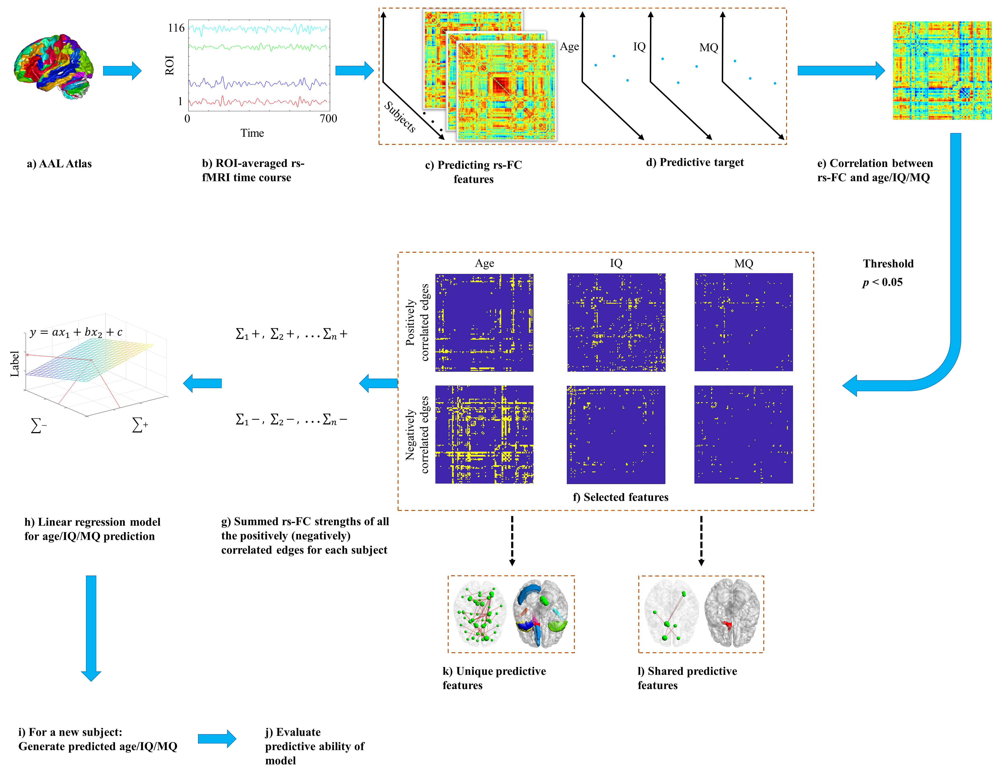
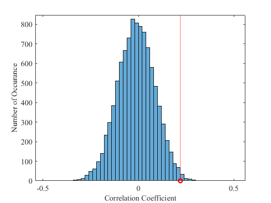

# CPM

[English version](README.md)



CPM_main.m
主函数，接受11个输入
- Data：输入数据，形状为 被试数量*脑网络中边数量
- Label：需要预测的变量，形状为被试数量*1
- Covariate：回归分析中用到的协变量，可以为空[]，或者为 被试数量*~ 的矩阵
- K_fold：k折交叉验证中的组数，一般为10，即十折交叉验证
- P_thr：筛选用于回归分析的边的阈值，一般为0.05
- pos_neg：用于控制如何选择回归变量，一般为3
  - 1：只使用正相关的边
  - 2：只使用负相关的边
  - 3：正相关和负相关的边都使用
- Para_sel：选择是否将边权重相加，一般为1
  - 1：求和，如果选出10条相关的边，会将这10条边的权重相加得到一个变量用于回归
  - 2：不求和，如果选出10条相关的边，则这10条边的权重都会用于回归分析
- Regre_method：回归方法，一般为1
  - 1：matlab中的regress函数
  - 2：matlab中的鲁棒回归函数robustfit
  - 3：支持向量回归svr，可能需要安装对应的包
- Print：是否打印相关信息，一般为false
- Shuffle：是否对数据打乱顺序，一般为true
- Norma：是否对自变量和协变量做归一化

返回
- perform：模型预测的变量和真实变量的相关系数
- rmse_err：模型预测变量和真实变量的均方根误差
- predict_label：模型预测的变量
- pos_edge：模型运行过程中选择的正相关的边，因为会有交叉验证，所以一条边可能出现多次
- neg_edge：模型运行过程中选择的负相关的边，因为会有交叉验证，所以一条边可能出现多次

运行
- 构造随机数据
```matlab
num_sub = 300;
num_edge = 5000;

Label = randi([20 100], num_sub, 1);
Data = Label*randn(1, num_edge) + Label.*randn(num_sub, num_edge)*20;
```
- 运行CPM
```matlab
[perform, rmse_err, predict_label, pos_edge, neg_edge] = CPM_main(Data, Label, [], 10, 0.05, 3, 1, 1, false, true, true);

disp('perform');
disp(perform);
disp('rmse_err');
disp(rmse_err);
```

因为运行过程中会shuffle打乱数据顺序，所以同样的数据每次运行可能得出不一样的结果，为了使运行结果更鲁棒，可以将CPM重复运行多次
```matlab
time = 1000; %重复运行的次数
[perform, mse_err, predict_label, pos_edge, neg_edge] = CPM_repeat(time, Data, Label, [], 10, 0.05, 3, 1, 1, false, true, true);

disp('perform');
disp(mean(perform, 'omitnan'));
disp('rmse_err');
disp(mean(rmse_err, 'omitnan'));
```
为了构造出预测值与真实值相关系数的非参数统计分布，随机打乱数据和label的pair队，并运行CPM算法得到相关系数，重复这一过程得到相关系数的非参数分布
```matlab
time = 10000; %重复运行的次数
[perform_perm, mse_err_perm] = CPM_perm_test(time, Data, Label, [], 10, 0.05, 3, 1, 1, false, true, true);

plot_figure(perform_perm, perform);
```

