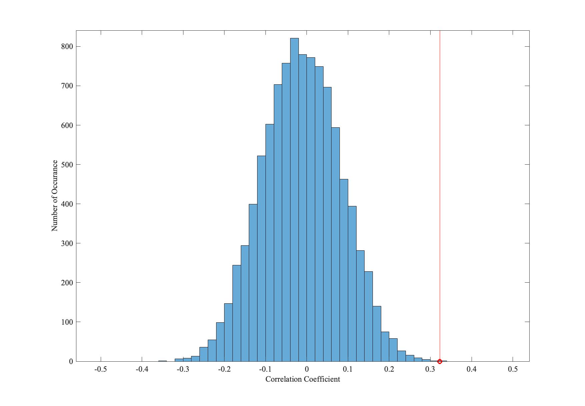

# CPM

[中文版](README_zh.md)


CPM_main.m
Main function, accepts 11 inputs
- Data：input data with shape number of subjects * number of edge
- Label： The variable that needs to be predicted, with a shape of the number of subjects * 1
- Covariate：Covariates used in the regression analysis, which can be empty [], or a matrix with a shape of the number of subjects * ~
- K_fold：The number of groups in the k-fold cross-validation, usually set to 10, i.e., ten-fold cross-validation
- P_thr：The threshold for selecting edges used in the regression analysis, usually set to 0.05
- pos_neg：Used to control how to select regression variables, usually set to 3
  - 1：Only use positively correlated edges
  - 2：Only use negatively correlated edges
  - 3： Use both positively and negatively correlated edges
- Para_sel：Choose whether to sum the edge weights, usually set to 1
  - 1：Summation; if 10 correlated edges are selected, the weights of these 10 edges will be summed to form a variable for regression
  - 2：No summation; if 10 correlated edges are selected, the weights of all these 10 edges will be used for regression analysis
- Regre_method：Regression method, usually set to 1
  - 1：regress function in Matlab
  - 2：robustfit function in Matlab
  - 3： Support Vector Regression (SVR), may require the installation of corresponding packages
- Print：Whether to print relevant information, usually set to false
- Shuffle：Whether to shuffle the order of the data, usually set to true
- Norma：Whether to normalize the independent and covariate variables

returns
- perform: The correlation coefficient between the variables predicted by the model and the actual variables
- rmse_err: The root mean square error between the variables predicted by the model and the actual variables
- predict_label: The variables predicted by the model
- pos_edge: The positively correlated edges selected during the model's execution. Due to cross-validation, an edge may appear multiple times
- neg_edge: The negatively correlated edges selected during the model's execution. Due to cross-validation, an edge may appear multiple times
- Execution:

Generate random data
```matlab
num_sub = 300;
num_edge = 5000;

Label = randi([20 100], num_sub, 1);
Data = Label*randn(1, num_edge) + Label.*randn(num_sub, num_edge)*20;
```
- Run CPM
```matlab
[perform, rmse_err, predict_label, pos_edge, neg_edge] = CPM_main(Data, Label, [], 10, 0.05, 3, 1, 1, false, true, true);

disp('perform');
disp(perform);
disp('rmse_err');
disp(rmse_err);
```

Because the data order may be shuffled during the execution, the same data might produce different results each time the function runs. To make the results more robust, the Connectome-based Predictive Modeling (CPM) can be run multiple times.
```matlab
time = 1000; %Number of repeated runs
[perform, mse_err, predict_label, pos_edge, neg_edge] = CPM_repeat(time, Data, Label, [], 10, 0.05, 3, 1, 1, false, true, true);

disp('perform');
disp(mean(perform, 'omitnan'));
disp('rmse_err');
disp(mean(rmse_err, 'omitnan'));
```
To construct a non-parametric statistical distribution of the correlation coefficient between the predicted values and the actual values, randomly shuffle the pairs of data and labels, and run the CPM (Connectome-based Predictive Modeling) algorithm to obtain the correlation coefficients. Repeat this process to obtain a non-parametric distribution of the correlation coefficients.
```matlab
time = 10000; %Number of repeated runs
[perform_perm, mse_err_perm] = CPM_perm_test(time, Data, Label, [], 10, 0.05, 3, 1, 1, false, true, true);

plot_figure(perform_perm, perform);
```

